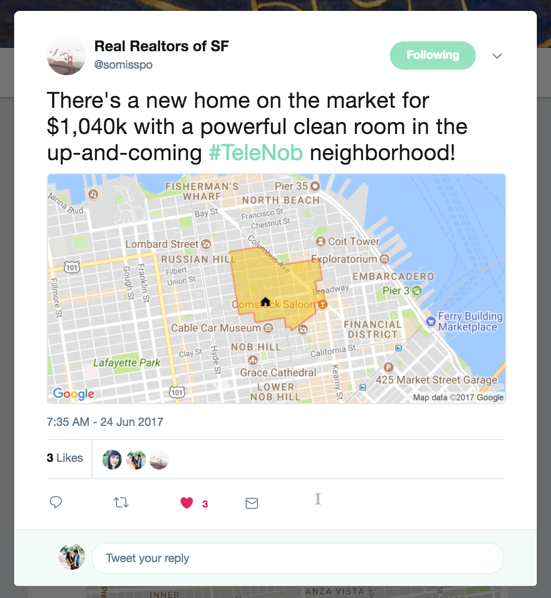

[somisspo bot](https://twitter.com/somisspo)
============================================

this bot generates a random san francisco neighborhood name, and then maps out what that neighborhood could potentially look like. it then generates a house listing, with a random `adjective` `room` and the house costing some `amount of money`, and adds a little house icon somewhere in the neighborhood.

the primary inspiration was to take the concept of creating neighborhoods to their absurd extreme.

the process
===========

i had originally just planned on generating the names of a random neighborhood, but then realized that a map would convey the point so much better, and it would be well worth the effort. the final part of the process was to generate a good caption that mimicked housing listings.

i have the bot hosted on glitch, and it posts every day to twitter. 

part a (the NAME)
=================

the entire process kicks off with a generated neigborhood name, which is a combination of two existing neighborhoods. this neighborhood has to be plausible, so its two parents have to be close to each other. to get this relationship, i created a list of all sf neighborhoods, grabbed their centroid latitude/longitudes using the google maps api, and then created a dictionary where for each neighborhood i had other neighborhood that were less than a distance of [x] away. 

i used the cartesian distance, simply because sf is small enough and this project rough enough that it wouldn't matter -- but it's always important to know that the haversine distance is what i really wanted.

the algorithm picks a neighborhood at random, and then one of its neighborhoods. once i have these two neighborhoods, i split the names into syllables, and then take a combination of those syllables, capitalizing as necessary. to ensure quality though i do have some rules: 
1) i take out some words, like `valley`
2) i manually split some words, such as `marina` -> `mar` + `ina` as opposed to `ma` + `ri` + `na`
3) i make sure to remember if the syllable i take is at the beginning of the name, for capitalization reasons: that way it's `Noeres` and not `NoeRes` for `Dolores` + `Noe`, but it's still `DoloNoe` instead of `Dolonoe` (though, i guess it works in this case...)

part b (the MAP)
================

the [google maps api](https://developers.google.com/maps/documentation/) was invaluable in generating the map of the neighborhood. at this stage i already had the name of the neighborhood, and i also had its two parents. for each parent i took grabbed its coordinates (using the api), and then calculated the most-northwestern, most-northeastern points, and ended up with a rectangle of eight points (grab the midpoint of each pair of corners). i then input these points into the `snaptoroads` endpoint, which returned the roads that were closest the the points. this resulted in a more believable neighborhood bound by streets, instead of straight lines.

i also plotted a tiny house marker a random, small, distance away from the midpoint of the parent neighborhoods (effectively the centroid of the generated neighborhood).

the maps api also provides a static map endpoint, where you pass in all your map parameters (a url with the neighborhood boundaries, house coordinates, and styles) and it will return an image. it's then easy to upload and post that image to twitter.

part c (the CAPTION)
====================

the caption is my least favorite part of the project, and i would want to re-do this part of the process the most. it simply takes a sentence template, and plugs in a random relevant word from a corpus (i used [corpora](https://github.com/dariusk/corpora)). this results in an okay, random-ish house listing. i also calculate a random asking price, somewhere between 600-1600k dollars. for some of these, i also include a randomized date for the (fake) open house. 

> We have a lifechanging #Financon home with a beautiful computer lab for sale at $1,530k.

> There's a new home on the market for $1,040k with a powerful clean room in the up-and-coming #TeleNob neighborhood!

the corpus obviously wasn't meant for house listings, so if more work was to be done i'd try harder to make this caption more realistic, with better words. maybe there's also an opportunity to bring in craigslist posts?